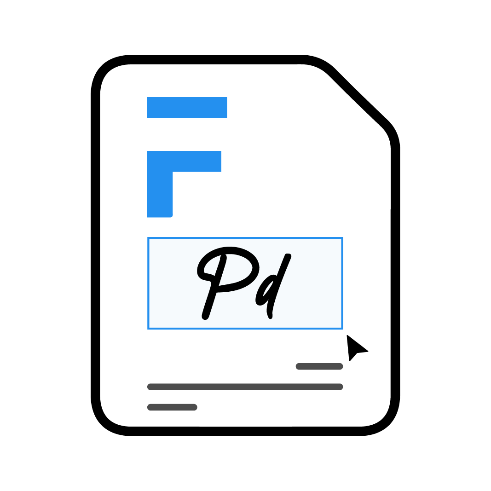

# Print Designer

## Frappe App to Design Print Formats using interactive UI.

<div align="center" markdown="1">


*Free and Open Source App to **Design Print Formats** using **Interactive UI** for your Frappe Apps*

</div>

## Installation
### Local

To setup the repository locally follow the steps mentioned below:

1. Install bench and setup a `frappe-bench` directory by following the [Installation Steps](https://frappeframework.com/docs/user/en/installation)
2. Start the server by running 
```
bench start
```
3. In a separate terminal window, create a new site by running 
```
bench new-site print-designer.test
```
4. Map your site to localhost with the command 
```
bench --site print-designer.test add-to-hosts
```
5. Get the Print Designer app
```
bench get-app https://github.com/frappe/print_designer
```
6. Install the app on the site. 
```
bench --site print-designer.test install-app print_designer
```
7.  Open [http://print-designer.test:8000/](http://print-designer.test:8000/) in your browser and go through the setup wizard. 

8.  After the setup is complete now open [http://print-designer.test:8000/app/print-designer/](http://print-designer.test:8000/app/print-designer/)
---
## Contributions and Community

There are many ways you can contribute even if you don't code:

1. You can start by giving a star to this repository!
1. If you find any issues, even if it is a typo, you can [raise an issue](https://github.com/frappe/print_designer/issues/new) to inform us.

---

## FAQ
1. Mac Installation Error
    - If error has `npm ERR! node-pre-gyp WARN Pre-built binaries not found for canvas@x.x.x` it means that there aren't any pre-built binaries for your system so it will try to compile them and in order to do that you need 
    - Xcode Command Line Tools `xcode-select --install`
    - [HomeBrew](https://brew.sh/) and `brew install pkg-config cairo pango libpng jpeg giflib librsvg pixman`
    - If you have **xcode 10.0 or higher** installed, in order to build from source you need **NPM 6.4.1 or higher** `npm install -g npm@latest`.

## License

[GNU Affero General Public License v3.0](license.txt)