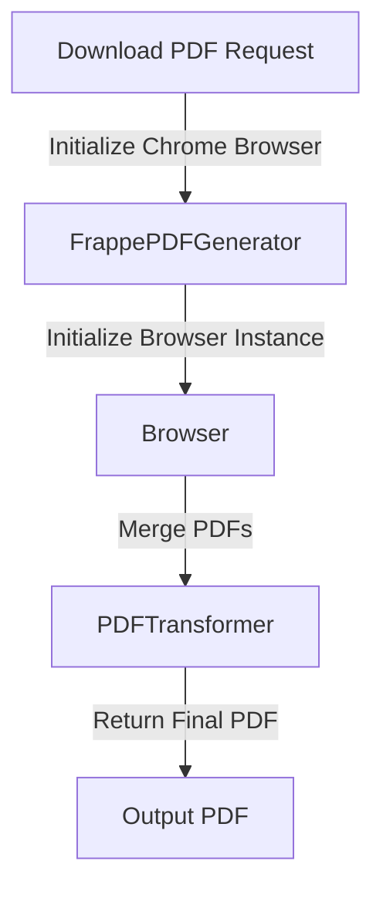
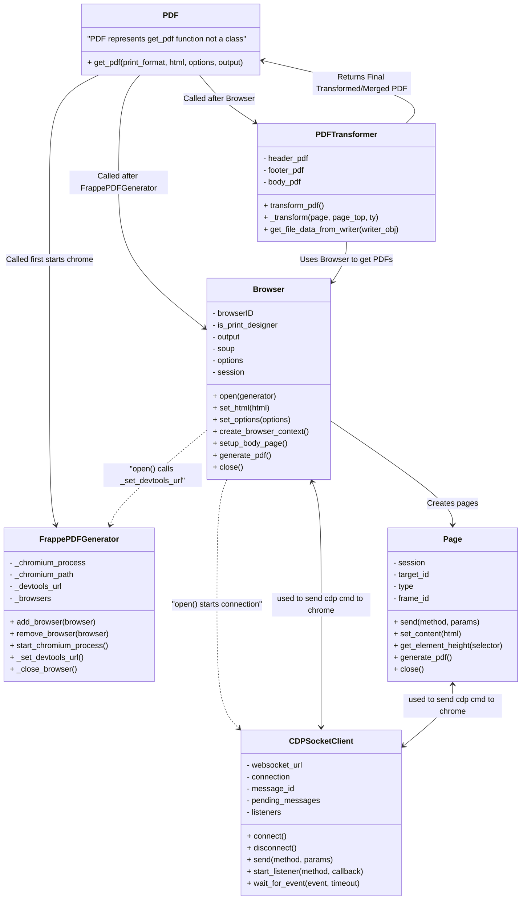

# Please Use Github to look at the diagram as it has better interface and can be zoomed properly

## Overall

```mermaid
graph TD
    A[Download PDF Request] -->|Initialize Chrome Browser| B[FrappePDFGenerator]
    B -->|Initialize Browser Instance| C[Browser]
    C -->|Merge PDFs| D[PDFTransformer]
    D -->|Return Final PDF| E[Output PDF]
```

## class diagram

```mermaid
classDiagram
    %% ====== MAIN COMPONENTS ======
    class PDF {
        "PDF represents get_pdf function not a class"
        + get_pdf(print_format, html, options, output)
    }

    class FrappePDFGenerator {
        - _chromium_process
        - _chromium_path
        - _devtools_url
        - _browsers
        + add_browser(browser)
        + remove_browser(browser)
        + start_chromium_process()
        + _set_devtools_url()
        + _close_browser()
    }

    class Browser {
        - browserID
        - is_print_designer
        - output
        - soup
        - options
        - session
        + open(generator)
        + set_html(html)
        + set_options(options)
        + create_browser_context()
        + setup_body_page()
        + generate_pdf()
        + close()
    }

    class PDFTransformer {
        - header_pdf
        - footer_pdf
        - body_pdf
        + transform_pdf()
        + _transform(page, page_top, ty)
        + get_file_data_from_writer(writer_obj)
    }

    %% ====== SUPPORTING COMPONENTS ======
    class CDPSocketClient {
        - websocket_url
        - connection
        - message_id
        - pending_messages
        - listeners
        + connect()
        + disconnect()
        + send(method, params)
        + start_listener(method, callback)
        + wait_for_event(event, timeout)
    }

    class Page {
        - session
        - target_id
        - type
        - frame_id
        + send(method, params)
        + set_content(html)
        + get_element_height(selector)
        + generate_pdf()
        + close()
    }

    %% ====== CLASS RELATIONSHIPS ======
    PDF --> FrappePDFGenerator : Called first starts chrome
    PDF --> Browser : Called after FrappePDFGenerator
    Browser ..> CDPSocketClient : "open() starts connection"
    Browser <--> CDPSocketClient : used to send cdp cmd to chrome
    Browser --> Page : Creates pages
    Page <--> CDPSocketClient : used to send cdp cmd to chrome
    PDF --> PDFTransformer : Called after Browser
    PDFTransformer --> Browser : Uses Browser to get PDFs
    PDFTransformer --> PDF : Returns Final Transformed/Merged PDF
    Browser ..> FrappePDFGenerator : "open() calls _set_devtools_url"
```

## Sequence Diagram

```mermaid
sequenceDiagram
    autonumber
    participant Client
    participant PDF as get_pdf function
    participant FPG as FrappePDFGenerator
    participant Browser
    participant HPage as HeaderPage (Page)
    participant FPage as FooterPage (Page)
    participant BPage as BodyPage (Page)
    participant CDP as CDPSocketClient
    participant PDFTrans as PDFTransformer

    %% ====== STEP 1: PDF REQUEST STARTS ======
    Client->>PDF: Request PDF

    %% ====== STEP 2: INITIALIZATION ======
    PDF->>FPG: init FrappePDFGenerator()
    FPG->>FPG: _initialize_chromium()
    FPG->>FPG: _find_chromium_executable()
    FPG->>FPG: _verify_chromium_installation()
    FPG->>FPG: start_chromium_process()
    FPG-->>PDF: Generator Initised
    PDF->>Browser: init Browser(generator, print_format, html, options, output)
    Browser->>Browser: set_html()
    Browser->>Browser: set_options()
    Browser->>Browser: open(generator)
    Browser->>FPG: _set_devtools_url()
    FPG-->>Browser: Return DevTools URL

    %% ====== STEP 3: ESTABLISH CDP CONNECTION & CONTEXT ======
    Browser->>CDP: init CDPSocketClient()
    CDP->>CDP: creates and sets asyncio event_loop
    CDP-->>Browser: CDPSocketClient Initised
    Browser->>CDP: session.connect()
    CDP-->>Browser: WebSocket Connection Established
    Browser->>Browser: create_browser_context()
    Browser->>CDP: session.send("Target.createBrowserContext")
    CDP-->>Browser: Return browserContextId

    %% ====== STEP 4: CREATE HEADER & FOOTER PAGES ======
    Browser->>Browser: _open_header_footer_pages()
    alt Header HTML is Avilable / Provided.
        Browser->>Browser: new_page("header")
        Browser->>HPage: init Page()
        HPage->>CDP: session.send("Target.createTarget")
        CDP-->>HPage: Return header targetId
        HPage->>CDP: session.send("Target.attachToTarget")
        CDP-->>HPage: Return sessionId
        HPage->>CDP: send("Page.enable") Note: page's send methods auto adds session id to request
        HPage->>HPage: get_frame_id_on_demand()
        HPage->>CDP: send("Page.getFrameTree")
        CDP-->>HPage: Return frame_id
        HPage->>HPage: set_media_emulation()
        HPage->>CDP: send("Emulation.setEmulatedMedia")
        HPage-->>Browser: HeaderPage Initised
        Browser->>HPage: header_page.set_tab_url(frappe.request.host_url)
        HPage->>HPage: intercept_request_and_fulfill()
        HPage->>CDP: send("Page.navigate")
        HPage-->>Browser: returns without waiting
    end

    alt Footer HTML is Avilable / Provided.
        Browser->>Browser: new_page("footer")
        Browser->>FPage: init Page()
        FPage->>CDP: send("Target.createTarget")
        CDP-->>FPage: Return footer targetId
        FPage->>CDP: send("Target.attachToTarget")
        CDP-->>FPage: Return sessionId
        FPage->>CDP: send("Page.enable")
        FPage->>FPage: get_frame_id_on_demand()
        FPage->>CDP: send("Page.getFrameTree")
        CDP-->>FPage: Return frame_id
        FPage->>FPage: set_media_emulation()
        FPage->>CDP: send("Emulation.setEmulatedMedia")
        FPage-->>Browser: FooterPage Initised
        Browser->>FPage: footer_page.set_tab_url(frappe.request.host_url)
        FPage->>FPage: intercept_request_and_fulfill()
        FPage->>CDP: send("Page.navigate")
        FPage-->>Browser: returns without waiting
    end

    %% ====== STEP 5: SET CONTENT FOR HEADER & FOOTER ======
    alt Header HTML is Avilable / Provided.
        Browser->>Browser: get_rendered_header_footer()
        Browser->>HPage: header_page.set_content()
        HPage->>HPage: intercept_request_for_local_resources()
        HPage->>HPage: wait_for_load()
        HPage->>CDP: send("Page.setDocumentContent")
        HPage-->>Browser: returns without waiting
    end
    alt Footer HTML is Avilable / Provided.
        Browser->>Browser: get_rendered_header_footer()
        Browser->>FPage: footer_page.set_content()
        FPage->>FPage: intercept_request_for_local_resources()
        FPage->>FPage: wait_for_load()
        FPage->>CDP: send("Page.setDocumentContent)
        FPage-->>Browser: returns without waiting
    end

    %% ====== STEP 6: GET HEADER/FOOTER ELEMENT is_dyanmic & height ======
    alt Header HTML is Avilable / Provided.
        Browser->>HPage: header_page.wait_for_set_content()
        HPage-->>Browser: Content is Set
        Browser->>HPage: header_page.get_element_height()
        HPage->>CDP: send("DOM.enable")
        HPage->>CDP: send("DOM.getDocument")
        CDP-->>HPage: Return documentNode
        HPage->>CDP: send("DOM.querySelector")
        CDP-->>HPage: Return matching element's nodeId
        HPage->>CDP: send("DOM.getBoxModel")
        CDP-->>HPage: Return boxModel
        HPage->>CDP: send("DOM.disable")
        HPage-->>Browser: Return header page height
        Browser->>HPage: is_page_no_used("header_content")
        HPage-->>Browser: returns is_header_dynamic
    end
    alt Footer HTML is Avilable / Provided.
        Browser->>FPage: footer_page.wait_for_set_content()
        FPage-->>Browser: Content is Set
        Browser->>FPage: footer_page.get_element_height()
        FPage->>CDP: send("DOM.enable")
        FPage->>CDP: send("DOM.getDocument")
        CDP-->>FPage: Return documentNode
        FPage->>CDP: send("DOM.querySelector")
        CDP-->>FPage: Return matching element's nodeId
        FPage->>CDP: send("DOM.getBoxModel")
        CDP-->>FPage: Return boxModel
        FPage->>CDP: send("DOM.disable")
        FPage-->>Browser: Return footer page height
        Browser->>FPage: is_page_no_used("footer_content")
        FPage-->>Browser: returns is_footer_dynamic
    end

    %% ====== STEP 7: SETUP BODY PAGE AND SET CONTENT ======
    Browser->>Browser: setup_body_page()
    Browser->>Browser: new_page("body")
    Browser->>BPage: init Page()
    BPage->>CDP: session.send("Target.createTarget")
    CDP-->>BPage: Return body targetId
    BPage->>CDP: session.send("Target.attachToTarget")
    CDP-->>BPage: Return sessionId
    BPage->>CDP: send("Page.enable") Note: page's send methods auto adds session id to request
    BPage->>BPage: get_frame_id_on_demand()
    BPage->>CDP: send("Page.getFrameTree")
    CDP-->>BPage: Return frame_id
    BPage->>BPage: set_media_emulation()
    BPage->>CDP: send("Emulation.setEmulatedMedia")
    BPage-->>Browser: BodyPage Initised
    Browser->>BPage: body_page.set_tab_url(frappe.request.host_url)
    BPage->>BPage: intercept_request_and_fulfill()
    BPage->>CDP: send("Page.navigate")
    BPage-->>Browser: returns without waiting
    Browser->>BPage: body_page.wait_for_navigate()
    BPage-->>Browser: Navigate Complete
    Browser->>BPage: body_page.set_content()
    BPage->>BPage: intercept_request_for_local_resources()
    BPage->>BPage: wait_for_load()
    BPage->>CDP: send("Page.setDocumentContent")
    BPage-->>Browser: returns without waiting

    %% ====== STEP 8: Print Designer HEADER/FOOTER PROCESSING  ======
    Browser->>Browser: prepare_options_for_pdf()
    Browser->>Browser: update_header_footer_page_pd()
    alt Print Designer Format and Static Header
    Browser->>HPage: header_page.evaluate()
    HPage->>CDP: send("Runtime.evaluate")
    end
    alt Print Designer Format and Static Footer
    Browser->>FPage: footer_page.evaluate()
    FPage->>CDP: send("Runtime.evaluate")
    end


    %% ====== STEP 8: CONDITIONAL HEADER PROCESSING (IF STATIC) ======
    Browser->>Browser: try_async_header_footer_pdf()
    alt Header is Static (No Page Numbers)
        Browser->>HPage: header_page.generate_pdf(wait_for_pdf=False)
        HPage->>HPage: add_page_size_css()
        HPage->>CDP: send("DOM.enable")
        HPage->>CDP: send("CSS.enable")
        HPage->>CDP: send("CSS.createStyleSheet")
        CDP-->>HPage: Returns styleSheetId
        HPage->>CDP: send("CSS.setStyleSheetText")
        HPage->>CDP: send("CSS.disable")
        HPage->>CDP: send("DOM.disable")
        HPage->>CDP: send("Page.printToPDF") [ Will not Wait for PDF ]
        CDP-->>HPage: Returns asyncio task to save in wait_for_pdf variable

    end
    %% ====== STEP 9: CONDITIONAL FOOTER PROCESSING (IF STATIC) ======
    alt Footer is Static (No Page Numbers)
        Browser->>FPage: footer_page.generate_pdf(wait_for_pdf=False)
        FPage->>FPage: add_page_size_css()
        FPage->>CDP: send("DOM.enable")
        FPage->>CDP: send("CSS.enable")
        FPage->>CDP: send("CSS.createStyleSheet")
        CDP-->>FPage: Returns styleSheetId
        FPage->>CDP: send("CSS.setStyleSheetText")
        FPage->>CDP: send("CSS.disable")
        FPage->>CDP: send("DOM.disable")
        FPage->>CDP: send("Page.printToPDF") [ Will not Wait for PDF ]
        CDP-->>FPage: Returns asyncio task to save in wait_for_pdf variable
    end

    %% ====== STEP 10: BODY PAGE WAIT FOR SET CONTENT AND GENERATE PDF ======
    Browser->>BPage: body_page.wait_for_set_content()
    Browser->>BPage: body_page.generate_pdf(raw=not header_page and not footer_page)
    BPage->>CDP: send("Page.printToPDF")
    CDP-->>BPage: Returns StreamId
    BPage->>CDP: send("IO.read", {streamId})
    CDP-->>BPage: Return PDF Data
    BPage->>CDP: send("IO.close", {streamId})
    BPage-->>Browser: Return Body PDF Data & total_pages
    Browser->>BPage: body_page.close()

    %% ====== STEP 11: Update Header Footer Page If Dynamic======
    Browser->>Browser: update_header_footer_page()

    %% ====== STEP 12: CONDITIONAL HEADER/FOOTER PROCESSING (IF DYNAMIC) ======
    alt Dynamic Header/Footer (Contains Page Numbers)
        HPage->>CDP: send("Runtime.evaluate", "clone_and_update()")
        FPage->>CDP: send("Runtime.evaluate", "clone_and_update()")
    end

    alt Static Header/Footer (No Page Numbers)
        Browser->>HPage: get_pdf_stream_id()
        HPage-->>Browser: returns task which will be used in wait_for_pdf
        HPage->>CDP: wait_for_pdf()  [ Waits for future to complete ]
        CDP-->>HPage: streamId
        Browser->>HPage: header_page.get_pdf_from_stream(streamId)
        HPage->>CDP: send("IO.read", {streamId})
        CDP-->>HPage: Return PDF Data
        HPage->>CDP: send("IO.close", {streamId})
        HPage-->>Browser: Returns Header PDF
        

        Browser->>FPage: get_pdf_stream_id()
        FPage-->>Browser: returns task which will be used in wait_for_pdf
        FPage->>CDP: wait_for_pdf() [ Waits for future to complete ]
        CDP-->>FPage: streamId
        Browser->>FPage: footer_page.get_pdf_from_stream(streamId)
        FPage->>CDP: send("IO.read", {streamId})
        CDP-->>FPage: Return PDF Data
        FPage->>CDP: send("IO.close", {streamId})
        FPage-->>Browser: Returns Footer PDF

    else  Dynamic Header/Footer (Contains Page Numbers)
          %% --- Generate PDFs for Updated Header/Footer ---
          HPage->>CDP: send("Page.printToPDF")
          CDP-->>HPage: Return streamID
          HPage->>CDP: send("IO.read", {streamId})
          CDP-->>HPage: Return PDF Data
          HPage->>CDP: send("IO.close", {streamId})
          HPage-->>Browser: Returns Header PDF

          FPage->>CDP: send("Page.printToPDF")
          CDP-->>FPage: Return streamID
          FPage->>CDP: send("IO.read", {streamId})
          CDP-->>FPage: Return PDF Data
          FPage->>CDP: send("IO.close", {streamId})
          FPage-->>Browser: Returns Footer PDF
      end

    Browser->>HPage: header_page.close()
    Browser->>FPage: footer_page.close()

    Browser->>Browser: close()
    Browser->>CDP: session.disconnect()
    CDP->>Browser: WebSocket Connection Disconnected

    %% ====== STEP 13: RETURN PDFs & MERGE ======
    Browser-->>PDF: Returns Instance with Body, Header, Footer PDFs
    PDF->>PDFTrans: transform_pdf(" browser instance")
    PDFTrans-->>PDF: Return Final Merged PDF

    %% ====== STEP 14: FINAL RESPONSE ======
    PDF-->>Client: Send Final PDF Response
```