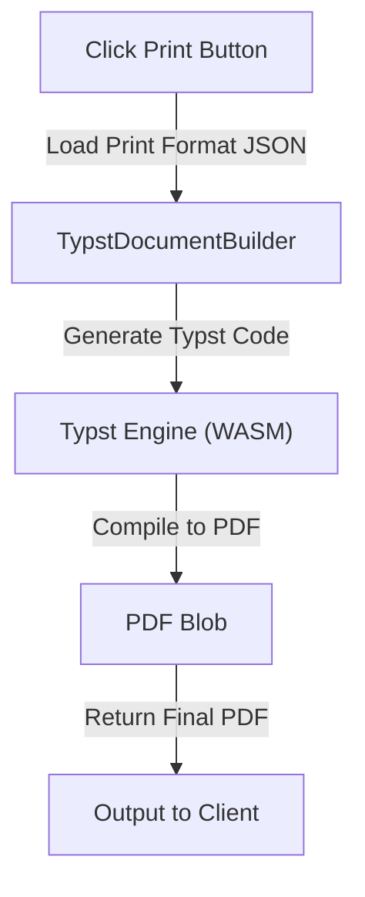
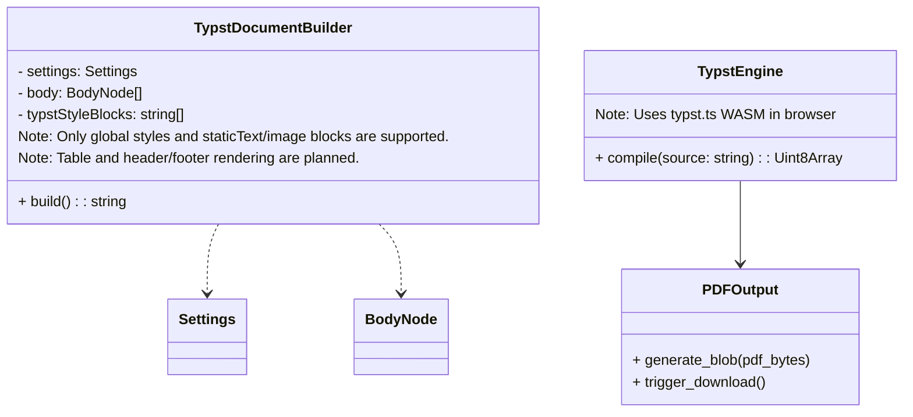
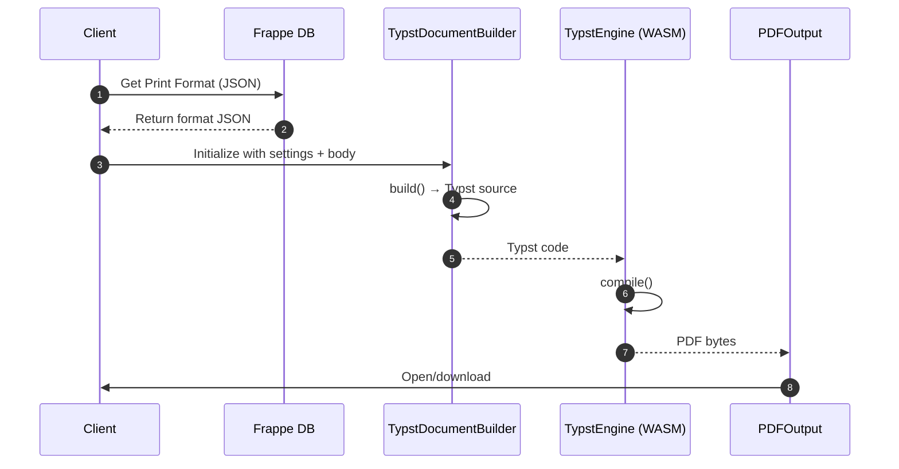

# Architecture of PDF generation using Typst.

## Overview

```mermaid
graph TD
	A[Click Print Button] -->|Load Print Format JSON| B["TypstDocumentBuilder"]
	B -->|Generate Typst Code| C["Typst Engine (WASM)"]
	C -->|Compile to PDF| D["PDF Blob"]
	D -->|Return Final PDF| E["Output to Client"]
```

## Class Diagram

```mermaid
classDiagram
	class TypstDocumentBuilder {
		+ build(): string
		- settings: Settings
		- body: BodyNode[]
		- typstStyleBlocks: string[]
		Note: Only global styles and staticText/image blocks are supported.
		Note: Table and header/footer rendering are planned.
	}

	class TypstEngine {
		+ compile(source: string): Uint8Array
		Note: Uses typst.ts WASM in browser
	}

	class PDFOutput {
		+ generate_blob(pdf_bytes)
		+ trigger_download()
	}

	TypstDocumentBuilder ..> Settings
	TypstDocumentBuilder ..> BodyNode
	TypstEngine --> PDFOutput
```

## Sequence Diagram

```mermaid
sequenceDiagram
	autonumber
	participant Client
	participant DB as Frappe DB
	participant Builder as TypstDocumentBuilder
	participant Engine as TypstEngine (WASM)
	participant PDF as PDFOutput

	Client->>DB: Get Print Format (JSON)
	DB-->>Client: Return format JSON

	Client->>Builder: Initialize with settings + body
	Builder->>Builder: build() → Typst source
	Builder-->>Engine: Typst code
	Engine->>Engine: compile()
	Engine-->>PDF: PDF bytes
	PDF->>Client: Open/download
```
