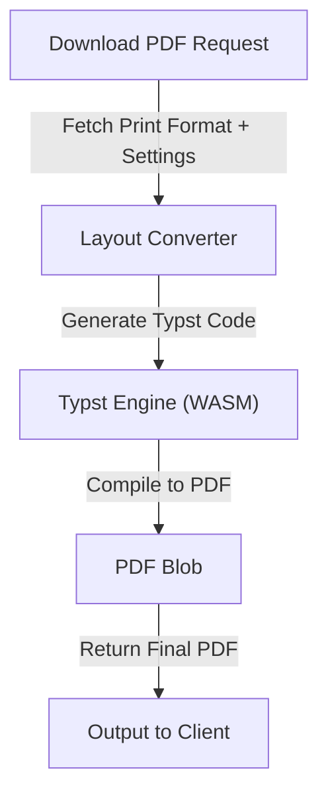
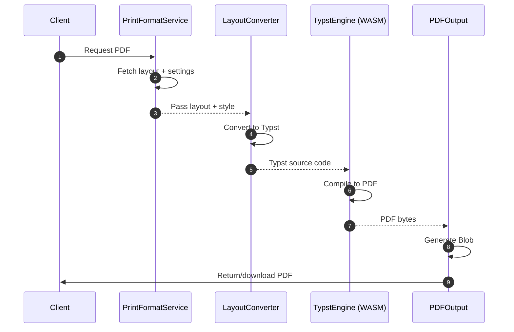

# Architecture of PDF generation using Typst.

## Overview


## Class Diagram
```mermaid
classDiagram
    class PrintFormatService {
        + fetch_layout(print_format)
        + fetch_settings(print_format)
    }

    class TypstDocumentBuilder {
        + build(): string
		Note: As of this stage, only global page settings and global styles are fully supported.
		Note: Full conversion of body/header/footer elements is planned for next phase.
        - layout: Layout
        - settings: Settings
        - typstStyleBlocks: string[]
        # renderHeader(): string
        # collectGlobalStyles(): void
    }

    class TypstEngine {
        + compile(source_code) : PDF
        Note: Uses typst.ts WASM in browser
    }

    class PDFOutput {
        + generate_blob(pdf_bytes)
        + trigger_download()
    }

    %% Show dependencies with utility functions and types

    TypstDocumentBuilder ..> Layout : uses
    TypstDocumentBuilder ..> Settings : uses

    TypstDocumentBuilder ..> "renderPageSettings()" : calls
    TypstDocumentBuilder ..> "renderPage()" : calls
    TypstDocumentBuilder ..> "rectangleStyleToTypst()" : calls
    TypstDocumentBuilder ..> "dynamicLabelStyleToTypst()" : calls
    TypstDocumentBuilder ..> "globalTextStyleToTypst()" : calls
    TypstDocumentBuilder ..> "tableGlobalStylesToTypst()" : calls

    Client --> PrintFormatService
    PrintFormatService --> TypstDocumentBuilder
    TypstDocumentBuilder --> TypstEngine
    TypstEngine --> PDFOutput
    PDFOutput --> Client
```

## Sequence Diagram

